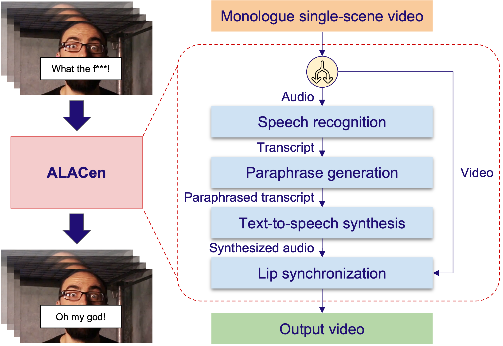

# ALACen: Automatic Language-level Adjustment for Video Censorship

## Table of Contents

- [About the Project](#about-the-project)
- [Installation](#installation)
- [Usage](usage)
- [Project Structure](#project-structure)
- [Acknowledgements](#acknowledgements)

## About the Project

This project is part of KAIST Spring 2024's course project of EE474: Introduction to Multimedia.

ALACen is a pipeline for Automatic Language-Level Adjustment for Video Censorship that uses deep-learning techniques to censor videos containing violent speeches while preserving immersion. ALACen consists of four stages: Speech Recognition, Paraphrase Generation, Text-to-Speech Synthesis, and Lip Synchronization.



## Installation

The instructions below assume that you already have Conda installed. If not so, follow the Conda installation guide [here](https://conda.io/projects/conda/en/latest/user-guide/install/index.html) before you proceed.

1. Create a new Conda environment with Python 3.9 and activate it. For example,

```
conda create -n alacen python=3.9 && conda activate alacen
```

2. Install Mamba using the following command. You need to restart your terminal after the installation finishes. We need Mamba because installing the dependencies with conda through the conda-forge channel often hangs.
   _Note: You can skip this step if you already have Mamba installed._

```
bash install_mamba.sh
```

3. Run the following command to install the dependencies and download pre-trained models. If it fails with a connection error, try running it again. _Note: You may have to activate your environment first before running the following command._

```
bash setup.sh
```

## Usage

We provide four options for running ALACen.

1. Execute the Python module. Replace `<path-to-your-video>` with the correct path.

```
python -m src.alacen -v --video <path-to-your-video> --num-gpus 3 --device cuda:3
```

2. Run the `run.ipynb` file. This gives you an interactive execution of ALACen. Put your configuration parameters in the Configuration cell and run all the cells. If you encounter the prompt saying files already exist, try removing those files and rerun the cell.

3. Run the `evaluate.ipynb` file. This gives you the feel of how ALACen's output videos for the user study were generated.

4. Run the Gradio demo application with the following command. Then, you can access the application with your browser by visiting the specified URL.

```
python app.py -v -s --num-gpus 3 --device cuda:3
```

Note that the current version runs on 4 NVIDIA GeForce GTX 1070 GPUs. If you have fewer but larger GPUs, you can set the number of GPUs and default device in the command line arguments accordingly.

## Project Structure

Following is the project structure.

```
ALACen/
├─install_mamba.sh                  # Scripts for installing Mamba
├─app.py                            # Gradio demo app
├─README.md                         # README file
├─run.ipynb                         # Notebook for running ALACen
├─src/                              # Source directory
│ ├─datasets/                       # Python scripts for constructing the Violent Speech dataset
│ └─alacen/                         # ALACen implementation
│   ├─asr/                          # Speech Recognition
│   ├─config.py                     # Configuration file
│   ├─tts/                          # Text-to-Speech Synthesis
│   ├─lipsync/                      # Lip Synchronization
│   ├─paraphrase/                   # Paraphrase Generation
│   ├─__main__.py                   # Main ALACen script
│   ├─alacen.py                     # ALACen class
│   └─...                           # Other helper and utility functions
├─setup.sh                          # Script for setting up the environment
├─demo/                             # Demo videos
├─assets/                           # Images and other assets
├─datasets/                         # Datasets
│ ├─violent_speech_list.txt         # Extracted violent speeches
│ └─violent_speech_dataset.json     # Violent Speech Dataset
├─requirements.txt                  # Dependencies
├─finetune_lm.ipynb                 # Notebook for fine-tuning the LM
└─evaluation.ipynb                  # Notebook for generating videos for the user study
```

## Acknowledgements

This repository contains code from the [diff2lip](https://github.com/soumik-kanad/diff2lip) and [VoiceCraft](https://github.com/jasonppy/VoiceCraft) repositories. Visit them for more detail.
